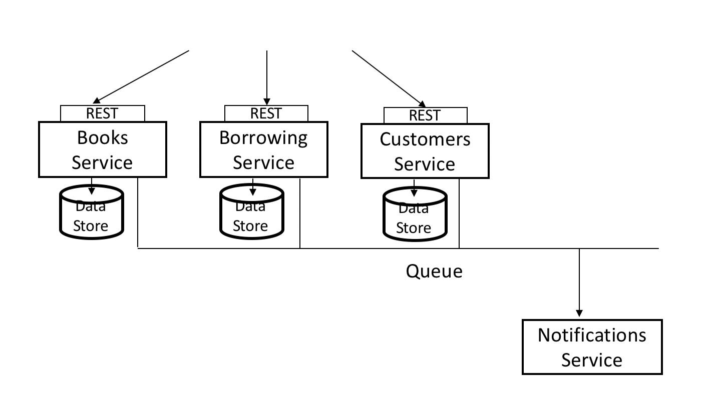

# Assignment for ITS ICT Microservices

## List of microservices 
>1. [Books microservice](./microservice/books):
>expose CRUD opereration, use flask framework and mongodb database
>1. [Customer microservice](./microservice/customer):
>expose CRUD opereration, use flask framework and mysql database
>1. [Borrowing microservice](./microservice/borrowing):
>expose CRUD opereration, use flask framework and mysql database

Assignment:

Develop 4 microservices as depicted in this diagram:

Microservices can be developed in any any techology , but they must comply with following constraints:

- Use HTTP/REST for synchronous communication
- Use at least two different database technology (RDBMS and NoSQL).
- Use a message broker (Kafka, Active MQ, Rabbit MQ) for asynchronous communications (ie: calling the Notification service)

Evaluation criteria:

- Microservices         (0 to 5 points)
- Design patterns       (0 to 5 points)
- Testing               (0 to 5 points)
- Logging and tracing   (0 to 5 points)
- CI/CD                 (0 to 5 points)
- Docker and Kubernetes (0 to 5 points)
 
